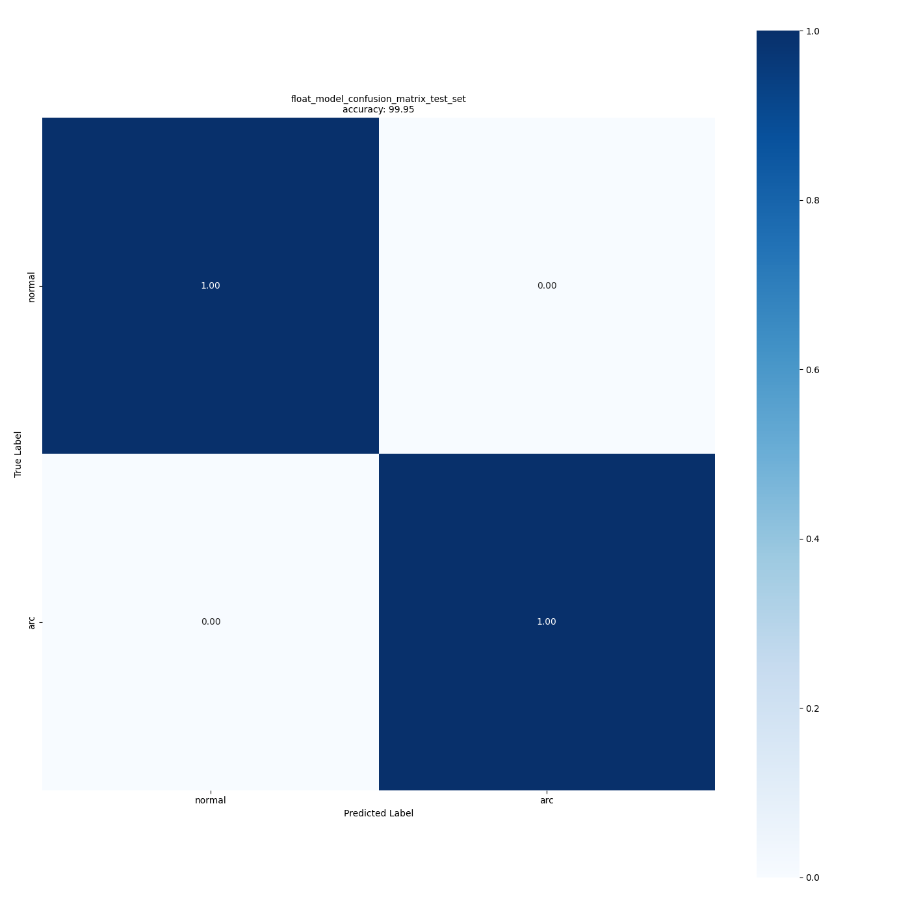

# Evaluation of Arc Fault Detection (AFD) model

This document explains how to evaluate a pretrained AFD model using the evaluation service. The service computes performance metrics for a given model on a specified dataset split (typically a test set) and prints the results in the terminal and log files.

## Table of Contents

<details open><summary><a href="#1"><b>1. Configure the YAML file</b></a></summary></details>
<details open><summary><a href="#2"><b>2. Evaluate your model</b></a></summary></details>
<details open><summary><a href="#3"><b>3. Visualize the evaluation results</b></a></summary></details>


<details open><summary><b><a href="#1">1. Configure the YAML file</a></b></summary><a id="1"></a>

To evaluate a pretrained AFD model, you can either edit the main [user_config.yaml](../user_config.yaml) file or use the minimal configuration provided in [evaluation_config.yaml](../config_file_examples/evaluation_config.yaml).

The example below illustrates how to configure evaluation for a reference AFD model trained on the afd_test_bench dataset.

<ul><details open><summary><a href="#1-1">1.1 Set the model and the operation mode</a></summary><a id="1-1"></a>

First, set the path to the pretrained model in the `model.model_path` field and select the evaluation service with `operation_mode`:

```yaml
model:
  model_path: ../../stm32ai-modelzoo/arc_fault_detection/st_conv/ST_pretrainedmodel_custom_dataset/afd_test_bench_dataset/st_conv_freq_4channels_512/st_conv_freq_4channels_512.keras
  model_name:
  input_shape: (4,512,1)   # (n_channels, seq_len, 1)

operation_mode: evaluation

```

In this configuration, the path to the frequency-domain AFD model trained on the afd_test_bench dataset is used for evaluation. The `input_shape` must be consistent with the setting used during training.

</details></ul>
<ul><details open><summary><a href="#1-2">1.2 Prepare the dataset</a></summary><a id="1-2"></a>

Information about the dataset used for evaluation is provided in the `dataset` section of the YAML file.

```yaml
dataset:
  dataset_name: afd_test_bench  # AFD dataset name
  class_names: [normal,arc]
  training_path: ./datasets/afd_test_bench/Arc_and_Normal_train.csv
  validation_path: 
  test_path: ./datasets/afd_test_bench/Arc_and_Normal_test.csv
  quantization_path:
  prediction_path: 
  test_split:
  validation_split: 
  quantization_split:
  to_cache: True  # Optional, use it to cache the dataset in memory for faster access
  seed: 123

```

When evaluating a pretrained model, you typically point `dataset.test_path` to a dedicated CSV file containing the test set.

- If `dataset.test_path` is set, evaluation runs on that file.
- If `dataset.test_path` is not set, a test set can be created by splitting the training data according to `test_split`.

For reproducibility, we recommend using an explicit test CSV file (as in the example above) and keeping the same dataset configuration between training and evaluation.

</details></ul>
<ul><details open><summary><a href="#1-3">1.3 Apply preprocessing</a></summary><a id="1-3"></a>

The dataset must be preprocessed exactly as during training. For the reference AFD configuration, the preprocessing section is:

```yaml
preprocessing:
  downsampling: False
  normalization: True
  time_domain: False
```

- `downsampling`: if `False`, the original sampling rate is preserved (provided that it is compatible with the model input length after FFT-based processing in the above example).
- `normalization`: if `True`, normalization parameters estimated on the training set are applied to the evaluation data.
- `time_domain`: if `False`, the pipeline computes frequency-domain features (FFT magnitude).

Preprocessing parameters must match those used when training and (if applicable) quantizing the model.

**Note:** For FFT-based preprocessing, the test window length must be at least `2 × input_shape[1]`, since the FFT spectrum is symmetric and only the positive half is retained.

</details></ul>

</details>
<details open><summary><b><a href="#2">2. Evaluate your model</a></b></summary><a id="2"></a>

If you chose to modify the [user_config.yaml](../user_config.yaml), you can evaluate the model by running the following command from the AFD folder:

```bash
python stm32ai_main.py 
```
If you chose to update the [evaluation_config.yaml](../config_file_examples/evaluation_config.yaml) and use it, then run the following command from the AFD folder: 

```bash
python stm32ai_main.py --config-path ./config_file_examples/ --config-name evaluation_config.yaml
```

</details>
<details open><summary><b><a href="#3">3. Visualize the evaluation results</a></b></summary><a id="3"></a>

The accuracy is printed in the terminal and the confusion matrix is displayed. The confusion matrix is stored in  **experiments_outputs/\<date-and-time\>**. Below is an example of the confusion matrix displayed after running the evaluation service. 



You can also find the evaluation results saved in the log file **stm32ai_main.log** under **experiments_outputs/\<date-and-time\>**.

You can also visualize the results using MLflow. From `tf/src/experiments_outputs/`, run `mlflow ui` and open the provided link in your browser.

</details>
