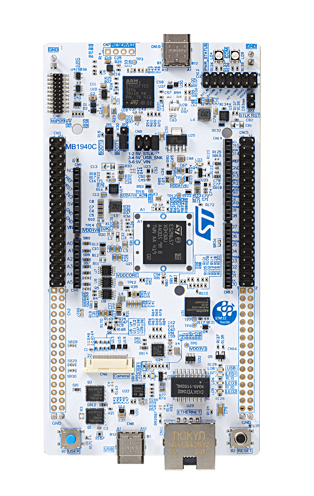

# Re-Identification STM32N6 Model Deployment

This tutorial demonstrates how to deploy a pre-trained re-identification model built with quantized tflite or ONNX QDQ on an STM32N6 board using STEdgeAI.

## Table of contents

- [1. Before you start](#1-before-you-start)
  - [1.1 Hardware Setup](#11-hardware-setup)
  - [1.2 Software requirements](#12-software-requirements)
- [2. Configuration file](#2-configuration-file)
  - [2.1 Setting the Model and the Operation Mode](#21-setting-the-model-and-the-operation-mode)
  - [2.2 Dataset configuration](#22-dataset-configuration)
    - [2.2.1 Preprocessing info](#221-preprocessing-info)
    - [2.2.2 Application info](#222-Application-info)
  - [2.3 Deployment parameters](#23-deployment-parameters)
  - [2.4 Hydra and MLflow settings](#24-hydra-and-mlflow-settings)
- [3. Deployment](#3-deployment)
  - [3.0 Boot modes](#30-boot-modes)
  - [3.1 STM32N6570-DK](#31-stm32n6570-dk)
  - [3.2 NUCLEO-N657X0-Q](#32-nucleo-n657x0-q)

## 1. Before you start

### 1.1 Hardware Setup

The [STM32N6 application code](../../application_code/re_identification/STM32N6/README.md) submodule:

```bash
 git submodule update --init application_code/re_identification/STM32N6
```
This application code runs with either:

- [STM32N6570-DK](https://www.st.com/en/evaluation-tools/stm32n6570-dk.html) discovery board
- [NUCLEO-N657X0-Q](https://www.st.com/en/evaluation-tools/nucleo-n657x0-q.html) nucleo board

- And one of the following camera modules:
  - MB1854 IMX335 camera module (provided with STM32N6570-DK board)
  - [STEVAL-55G1MBI](https://www.st.com/en/evaluation-tools/steval-55g1mbi.html)
  - [STEVAL-66GYMAI1](https://www.st.com/en/evaluation-tools/steval-66gymai.html)
__Note__: Camera detected automatically by the firmware, no config required.

- Optional screen for nucleo board:
  - [X-NUCLEO-GFX01M2](https://www.st.com/en/evaluation-tools/x-nucleo-gfx01m2.html)

### 1.2 Software requirements

1. [STEdgeAI Core](https://www.st.com/en/development-tools/stedgeai-core.html) to generate network C code from tflite/onnx model.
2. [STM32CubeIDE](https://www.st.com/en/development-tools/stm32cubeide.html) to build the embedded project.

## 2. Configuration file

To deploy your model, you need to fill a YAML configuration file with your tools and model info, and then launch `stm32ai_main.py`.

As an example, we will show how to deploy [osnet_a100_256_128_tfs_int8.tflite](https://github.com/STMicroelectronics/stm32ai-modelzoo/tree/master/re_identification/osnet/ST_pretrainedmodel_public_dataset/DeepSportradar/osnet_a100_256_128_tfs/osnet_a100_256_128_tfs_int8.tflite).
To get this model, clone the [ModelZoo repo](https://github.com/STMicroelectronics/stm32ai-modelzoo/) in the same folder you cloned the [STM32 ModelZoo services repo](https://github.com/STMicroelectronics/stm32ai-modelzoo-services/).

To configure the deployment, edit [`../config_file_examples/deployment_config.yaml`](../config_file_examples/deployment_config.yaml).

### 2.1 Setting the model and the operation Mode

```yaml
model:
  model_path: ../../stm32ai-modelzoo/re_identification/osnet/ST_pretrainedmodel_public_dataset/DeepSportradar/osnet_a100_256_128_tfs/osnet_a100_256_128_tfs_int8.tflite
```

Configure the __operation_mode__ section as follow:

```yaml
operation_mode: deployment
```

### 2.2 Dataset configuration

#### 2.2.1 Preprocessing info

Configure the __preprocessing__ section as follow:

```yaml
preprocessing:
  resizing:
    interpolation: bilinear
    aspect_ratio: fit
  color_mode: rgb
```

#### 2.2.2 Application info

The application behavior can be tuned using __app__ section.

```yaml
app:
  max_object_detect: 20
  max_object_tracking: 10
  score_threshold: 0.5
  lost_time_in_ms: 60000
  start_tracking_conf_threshold: 0.9
```

- `max_object_detect`: An *int* that give maximum number of persons that can be output by people detector model.
- `max_object_tracking`: An *int* that give maximum number of persons that application can track.
- `score_threshold`: A *float* between 0.0 and 1.0, threshold use to re identify or not a person.
- `lost_time_in_ms`: An *int* that give time before a lost person is removed from tracked person list.
- `start_tracking_conf_threshold`: A *float* between 0.0 and 1.0, people detector threshold use to start tracking a new person.

### 2.3 Deployment parameters

To deploy the model in __STM32N6570-DK__ board, you will use:

1. *STEdgeAI* to convert the model into optimized C code
2. *STM32CubeIDE* to build the C application and flash the board.

These steps will be done automatically by configuring the __tools__ and __deployment__ sections in the YAML file as the following:

```yaml
tools:
  stedgeai:
    optimization: balanced
    on_cloud: False
    path_to_stedgeai: C:/ST/STEdgeAI/<x.y>/Utilities/windows/stedgeai.exe
  path_to_cubeIDE: C:/ST/STM32CubeIDE_<*.*.*>/STM32CubeIDE/stm32cubeide.exe

deployment:
  c_project_path: ../application_code/re_identification/STM32N6/
  IDE: GCC
  verbosity: 1
  hardware_setup:
    serie: STM32N6
    board: STM32N6570-DK # NUCLEO-N657X0-Q or STM32N6570-DK
    output: "UVCL" # default image output interface; "UVCL" (USB display) or "SPI" (X-NUCLEO-GFX01M2). Used only with NUCLEO-N657X0-Q
```

- `tools/stedgeai`
  - `optimization` *String*, define the optimization used to generate the C model, options: "*balanced*", "*time*", "*ram*".
  - `on_cloud` *Boolean*, True/False.
  - `path_to_stedgeai` *Path* to stedgeai executable file to use local download, else __False__.
- `tools/path_to_cubeIDE` *Path* to stm32cubeide executable file.
- `deployment`
  - `c_project_path` *Path* to [application C code](../../application_code/object_detection/STM32N6/README.md) project.
  - `IDE` __GCC__, only supported option for *stm32ai application code*.
  - `verbosity` *0* or *1*. Mode 0 is silent, and mode 1 displays messages when building and flashing C application on STM32 target.
  - `serie` __STM32N6__
  - `board` __STM32N6570-DK or NUCLEO-N657X0-Q__, see the [README](../../application_code/object_detection/STM32N6/README.md) for more details.
  - `output` __"SPI"__ to use X-NUCLEO-GFX01M2. __"UVCL"__ to use USB/UVC host as display. Only used for __NUCLEO-N657X0-Q__.

### 2.4 Hydra and MLflow settings

The `mlflow` and `hydra` sections must always be present in the YAML configuration file. The `hydra` section can be used to specify the name of the directory where experiment directories are saved. This pattern allows creating a new experiment directory for each run.

```yaml
hydra:
  run:
    dir: ./tf/src/experiments_outputs/${now:%Y_%m_%d_%H_%M_%S}
```

The `mlflow` section is used to specify the location and name of the directory where MLflow files are saved, as shown below:

```yaml
mlflow:
  uri: ./tf/src/experiments_outputs/mlruns
```

## 3. Deployment

### 3.0 Boot modes

The STM32N6 does not have any internal flash. To retain your firmware after a reboot, you must program it in the external flash. Alternatively, you can load your firmware directly from SRAM (dev mode). However, in dev mode if you turn off the board, your program will be lost.

__Boot modes:__

- Dev mode (STM32N6570-DK: both boot switches to the right, NUCLEO-N657X0-Q: BOOT0 JP1 in position 1, BOOT1 JP2 in position 2): used to load the firmware from debug session in RAM, or program firmware in external flash
- Boot from flash (STM32N6570-DK: both boot switches to the left, NUCLEO-N657X0-Q: BOOT0 JP1 in position 1, BOOT1 JP2 in position 1): used to boot the firmware in external flash

### 3.1 STM32N6570-DK

__1.__ Connect the CSI camera module to the *STM32N6570-DK* discovery board with a flat cable.


__2.__ Connect the discovery board from the STLINK-V3EC USB-C port to your computer using an __USB-C to USB-C cable__.

__Warning__: using USB-A to USB-C cable may not work because of possible lack of power delivery.


__3.__ Set to [dev mode](#30-boot-modes) and disconnect/reconnect the power cable of your board.

__4.__ Once [`deployment_config.yaml`](../config_file_examples/deployment_config.yaml) filled, launch:

```bash
python stm32ai_main.py --config-path ./config_file_examples/ --config-name deployment_config.yaml
```

__5.__ Once the application deployment complete, set to [boot from flash mode](#30-boot-modes) and disconnect/reconnect the power cable of your board.

__6.__ When the application is running on the *STM32N6570-DK* board, the LCD displays the following information:

- Data stream from camera board
- The mean inference time
- Bounding boxes with object id
- The number of detected object

### 3.2 NUCLEO-N657X0-Q

__1.__ Connect the CSI camera module to the *NUCLEO-N657X0-Q* nucleo board with a flat cable.

__2.__ Connect the nucleo board from the STLINK-V3EC USB-C port to your computer using an __USB-C to USB-C cable__.

__Warning__: using USB-A to USB-C cable may not work because of possible lack of power delivery.



__3.__ Set to [dev mode](#30-boot-modes) and disconnect/reconnect the power cable of your board.

__4.__ Once [`deployment_config.yaml`](../config_file_examples/deployment_config.yaml) filled, launch:

```bash
python stm32ai_main.py --config-path ./config_file_examples/ --config-name deployment_config.yaml
```

__5.__ Once the application deployment complete, set to [boot from flash mode](#30-boot-modes) and disconnect/reconnect the power cable of your board.

__6.__ When the application is running on the *NUCLEO-N657X0-Q* board, the LCD displays the following information:

- Data stream from camera board
- The mean inference time
- Bounding boxes with object id
- The number of detected object
