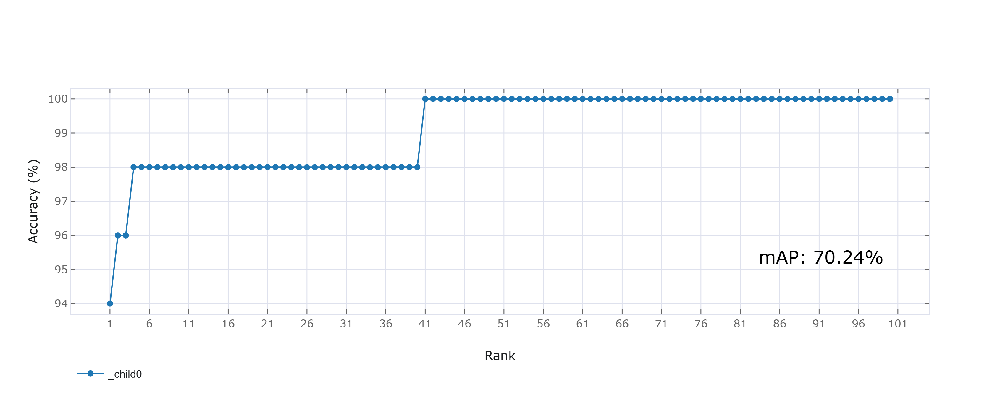

# Re-Identification STM32 Model Zoo
A Re-Identification (ReID) model is usually trained using a **classification-based architecture**, even though its final purpose is not classification in the traditional sense.

During **training**, the model consists of:

- A **backbone network** that processes the input image and produces a high-dimensional feature vector.
- A **classification head** that maps this feature vector to a set of predefined classes, where each class corresponds to a specific identity (person or vehicle) in the training dataset.

The model is optimized using classification losses (such as cross-entropy) and often combined with metric-learning losses (like triplet loss) to make features from the same identity closer together and features from different identities farther apart. This training procedure encourages the backbone to learn **embeddings** that capture identity-related characteristics while being robust to variations in pose, lighting, camera viewpoint, and background.

Once training is complete, the **classification head is discarded**, because the fixed set of training identities is no longer relevant at inference time. The trained backbone is then used **solely as a feature extractor**:

- Given an input image, the model outputs a **feature embedding** (a vector in an embedding space) instead of a class label.
- These embeddings are **comparable across images**: images of the same identity are expected to have embeddings that are close to each other, while images of different identities should result in embeddings that are far apart, according to a chosen distance metric (e.g., cosine or Euclidean distance).

This design allows the ReID model to:

- Work with **new, unseen identities** at inference time without retraining.
- Support tasks such as **query–gallery matching**, where a query image is compared against a database of gallery images by computing distances between their embeddings.
- Enable flexible deployment in real-world scenarios (e.g., surveillance, multi-camera tracking, access control) where the set of identities is not fixed and can change over time.

Although a ReID model is trained as a classifier, it is ultimately used as a **generic identity-aware feature extractor**, enabling robust comparison and matching of identities across different images without relying on a fixed, predefined label set.


Minimalistic YAML files are available [here](../config_file_examples/) to experiment with specific services. All pre-trained models in the [STM32 model zoo](https://github.com/STMicroelectronics/stm32ai-modelzoo/) come with their configuration `.yaml` files used to generate them. These are excellent starting points for your projects!

# Table of Contents

1. [Re-Identification Model Zoo Introduction](#1)
2. [Re-Identification Tutorial](#2)
   - [2.1 Choose the operation mode](#2-1)
   - [2.2 Global settings](#2-2)
   - [2.3 Dataset specification](#2-3)
   - [2.4 Apply image preprocessing](#2-4)
   - [2.5 Use data augmentation](#2-5)
   - [2.6 Set the model parameters](#2-6)
   - [2.7 Set the training parameters](#2-7)
   - [2.8 Model quantization](#2-8)
   - [2.9 Benchmark the model](#2-9)
   - [2.10 Deploy the model](#2-10)
   - [2.11 Hydra and MLflow settings](#2-11)
3. [Run the ReID chained service](#3)
4. [Visualize the chained services results](#4)
   - [4.1 Saved results](#4-1)
   - [4.2 Run TensorBoard](#4-2)
   - [4.3 Run ClearML](#4-3)
   - [4.4 Run MLflow](#4-4)
5. [Appendix A: YAML syntax](#A)

<details open><summary><a href="#1"><b>1. Re-Identification Model Zoo Introduction</b></a></summary><a id="1"></a>

The ReID model zoo provides a collection of independent services and pre-built chained services for various machine learning functions related to ReID. Individual services include tasks such as training or quantizing the model, while chained services combine multiple services to perform more complex functions, such as training, quantizing, and evaluating the quantized model successively.

To use the services in the ReID model zoo, utilize the model zoo [stm32ai_main.py](../stm32ai_main.py) along with the [user_config.yaml](../user_config.yaml) file as input. The YAML file specifies the service or chained services and a set of configuration parameters such as the model (either from the model zoo or your custom model), the dataset, the number of epochs, and the preprocessing parameters, among others.

More information about the different services and their configuration options can be found in the <a href="#2">next section</a>.

The ReID datasets should be structured in ReID format. The names of the image files before the first underscore indicate the identity. An example of this structure is shown below:

```bash
dataset_root_dir/
    id1_1.jpg
    id1_2.jpg
    id2_1.jpg
    id2_2.jpg
```
</details>
<details open><summary><a href="#2"><b>2.Re-Identification tutorial</b></a></summary><a id="2"></a>

This tutorial demonstrates how to use the `chain_tqeb` services to train, quantize, evaluate, and benchmark the model. Among the various available models in the model zoo, we chose to use the `DeepSportradar` ReID dataset and apply transfer learning on the MobileNet V1 image classification model as an example to demonstrate the workflow.

To get started, update the [user_config.yaml](../user_config.yaml) file, which specifies the parameters and configuration options for the services you want to use. Each section of the [user_config.yaml](../user_config.yaml) file is explained in detail in the following sections.

<ul><details open><summary><a href="#2-1">2.1 Choose the operation mode</a></summary><a id="2-1"></a>

The `operation_mode` top-level attribute specifies the operations or the service you want to execute. This may be a single operation or a set of chained operations.

The different values of the `operation_mode` attribute and the corresponding operations are described in the table below. In the names of the chain modes, 't' stands for training, 'e' for evaluation, 'q' for quantization, 'b' for benchmarking, and 'd' for deployment on an STM32 board.

| operation_mode attribute | Operations                                                                                                               |
|:-------------------------|:-------------------------------------------------------------------------------------------------------------------------|
| `training`               | Train a model from the variety of classification models in the model zoo or your own model                               |
| `evaluation`             | Evaluate the performance (Rank-N accuracy, mAP) of a float or quantized model on a test dataset (query and gallery sets)                                    |
| `quantization`           | Quantize a float model                                                                                                   |
| `prediction`             | Predict the identities to which images belong using a float or quantized model                                           |
| `benchmarking`           | Benchmark a float or quantized model on an STM32 board                                                                   |
| `deployment`             | Deploy a model on an STM32 board                                                                                         |
| `chain_tqeb`             | Sequentially: training, quantization of trained model, evaluation of quantized model, benchmarking of quantized model    |
| `chain_tqe`              | Sequentially: training, quantization of trained model, evaluation of quantized model                                     |
| `chain_eqe`              | Sequentially: evaluation of a float model,  quantization, evaluation of the quantized model                              |
| `chain_qb`               | Sequentially: quantization of a float model, benchmarking of quantized model                                             |
| `chain_eqeb`             | Sequentially: evaluation of a float model,  quantization, evaluation of quantized model, benchmarking of quantized model |
| `chain_qd`               | Sequentially: quantization of a float model, deployment of quantized model                                               |

You can refer to the README links below that provide typical examples of operation modes and tutorials on specific services:

   - [training, chain_tqe, chain_tqeb](./README_TRAINING.md)
   - [quantization, chain_eqe, chain_qb](./README_QUANTIZATION.md)
   - [evaluation, chain_eqeb](./README_EVALUATION.md)
   - [benchmarking](./README_BENCHMARKING.md)
   - [prediction](./README_PREDICTION.md)
   - [deployment, chain_qd on STM32N6](./README_DEPLOYMENT_STM32N6.md)

In this tutorial, the `operation_mode` used is the `chain_tqeb` as shown below to train a model, quantize, evaluate it, and later deploy it on the STM32 boards.

```yaml
operation_mode: chain_tqeb
```
</details></ul>
<ul><details open><summary><a href="#2-2">2.2 Global settings</a></summary><a id="2-2"></a>

The `general` section and its attributes are shown below.

```yaml
general:
   project_name: my_project           # Project name. Optional, defaults to "<unnamed>".
   logs_dir: logs                    # Name of the directory where log files are saved. Optional, defaults to "logs".
   saved_models_dir: saved_models    # Name of the directory where model files are saved. Optional, defaults to "saved_models".
   global_seed: 123                  # Seed used to seed random generators (an integer). Optional, defaults to 123.
   deterministic_ops: False          # Enable/disable deterministic operations (a boolean). Optional, defaults to False.
   display_figures: True             # Enable/disable the display of figures (training learning curves and confusion matrices).
                                     # Optional, defaults to True.
   gpu_memory_limit: 16              # Maximum amount of GPU memory in GBytes that TensorFlow may use (an integer).
   num_threads_tflite: 4             # Number of threads for tflite interpreter. Optional, defaults to 1
```

The `global_seed` attribute specifies the value of the seed to use to seed the Python, numpy, and TensorFlow random generators at the beginning of the main script. This is an optional attribute, with the default value being 123.

Even when random generators are seeded, it is often difficult to exactly reproduce results when the same operation is run multiple times. This typically happens when the same training script is run on different hardware. The `deterministic_ops` operator can be used to enable the deterministic mode of TensorFlow. If enabled, an operation that uses the same inputs on the same hardware will have the exact same outputs every time it is run. However, determinism should be used carefully as it comes at the expense of longer run times. Refer to the TensorFlow documentation for more details.

The `gpu_memory_limit` attribute sets an upper limit in GBytes on the amount of GPU memory TensorFlow may use. This is an optional attribute with no default value. If it is not present, memory usage is unlimited. If you have several GPUs, be aware that the limit is only set on logical gpu[0].

The `num_threads_tflite` parameter is only used as an input parameter for the tflite interpreter. Therefore, it has no effect on .keras or .onnx models. 
This parameter may accelerate the tflite model evaluation in the following operation modes:  `evaluation` (if a .tflite is specified in `model_path`), `chain_tqeb`, `chain_eqe`, `chain_tqe` and `chain_eqeb` (if the quantizer is the TFlite_converter). 
However, the acceleration depends on your system resources.

The `model_path` attribute is utilized to indicate the path to the model file that you wish to use for the selected operation mode. The accepted formats for `model_path` are listed in the table below:

| Operation mode | `model_path`                                     |
|:---------------|:-------------------------------------------------|
| 'evaluation'   | Keras, ONNX (float or QDQ) or TF-Lite model file |
| 'quantization', 'chain_eqe', 'chain_eqeb', 'chain_qb', 'chain_qd' | Keras or ONNX (float or QDQ) model file          |
| 'prediction'   | Keras, ONNX (float or QDQ) or TF-Lite model file |
| 'benchmarking' | Keras, TF-Lite or ONNX (float or QDQ) model file |
| 'deployment'   | TF-Lite or ONNX (QDQ) model file                 |

If you are using an operation mode that involves training, you can use the `model_path` attribute to train your own custom model instead of using a model from the Model Zoo. This is explained in detail in the [readme](./README_TRAINING.md) file for the train service. However, in this tutorial, the `model_path` attribute is not used since we are using a pre-trained model from the Model Zoo.

</details></ul>
<ul><details open><summary><a href="#2-3">2.3 Dataset specification</a></summary><a id="2-3"></a>

The `dataset` section and its attributes are shown in the YAML code below.

```yaml
dataset:
   dataset_name: DeepSportradar                                      # Dataset name. Defaults to "<unnamed>".
   training_path: ./datasets/DeepSportradar-ReID/reid_training                   # Path to the root directory of the training set.
   validation_path: <validation-set-root-directory>           # Path to the root directory of the validation set.
   validation_split: 0.2                                      # Training/validation sets split ratio.
   test_query_path: ./datasets/DeepSportradar-ReID/reid_test/query            # Path to the root directory of the test query set.
   test_gallery_path: ./datasets/DeepSportradar-ReID/reid_test/gallery          # Path to the root directory of the test gallery set.
   quantization_path: <quantization-set-root-directory>       # Path to the root directory of the quantization set.
   quantization_split:                                        # Quantization split ratio.
   check_image_files: False                                   # Enable/disable image file checking.
   seed: 123                                                  # Random generator seed used when splitting a dataset.
```

The `dataset_name` attribute is used to specify the considered dataset.

When working with a dataset for the first time, we suggest setting the `check_image_files` attribute to True. This will enable the system to load each image file and identify any corrupt, unsupported, or non-image files. The path to any problematic files will be reported. Once you have verified the cleanliness of your dataset or have cleaned it up, you can set `check_image_files` to False to avoid any potential run time penalties.

When a training is run, the training set is split in two to create a validation dataset if `validation_path` is not provided. When a model accuracy evaluation is run, the test set is used if there is one; otherwise, the validation set is used (either provided or generated by splitting the training set).

The `validation_split` attribute specifies the training/validation set size ratio to use when splitting the training set to create a validation set. The default value is 0.2, meaning that 20% of the training set is used to create the validation set. The `seed` attribute specifies the seed value to use for randomly shuffling the dataset file before splitting it (default value is 123).

The `quantization_path` attribute is used to specify a dataset for the quantization process. If this attribute is not provided and a training set is available, the training set is used for the quantization. However, training sets can be quite large, and the quantization process can take a long time to run. To avoid this issue, you can set the `quantization_split` attribute to use only a portion of the dataset for quantization.

</details></ul>
<ul><details open><summary><a href="#2-4">2.4 Apply image preprocessing</a></summary><a id="2-4"></a>

Images need to be rescaled and resized before they can be used. This is specified in the 'preprocessing' section that is required in all the operation modes.

The 'preprocessing' section for this tutorial is shown below.

```yaml
preprocessing:
   rescaling:
      # Image rescaling parameters
      scale : 1/127.5
      offset : -1
   resizing:
      # Image resizing parameters
      interpolation: nearest
      aspect_ratio: fit
   color_mode: rgb
```

Images are rescaled using the formula "Out = scale\*In + offset". Pixel values of input images usually are integers in the interval [0, 255]. If you set *scale* to 1./255 and offset to 0, pixel values are rescaled to the interval [0.0, 1.0]. If you set *scale* to 1/127.5 and *offset* to -1, they are rescaled to the interval [-1.0, 1.0].

The resizing interpolation methods that are supported include 'bilinear', 'nearest', 'bicubic', 'area', 'lanczos3', 'lanczos5', 'gaussian', and 'mitchellcubic'. Refer to the TensorFlow documentation of the `tf.image.resize` function for more details.

The `aspect_ratio` attribute may be set to either:
- 'fit', images will be fit to the target size. Input images may be smaller or larger than the target size. They will be distorted to some extent if their original aspect ratio is not the same as the resizing aspect ratio.
- 'crop', images will be cropped to preserve the aspect aspect. The input images should be larger than the target size to use this mode.
- 'padding', images will be padded with zeros (black borders) to meet the target size. The input images should be smaller than the target size to use this mode.

If some images in your dataset are larger than the resizing size and some others are smaller, you will obtain a mix of cropped and padded images if you set `aspect_ratio` to 'crop' or 'padding'.

The `color_mode` attribute can be set to either *"grayscale"*, *"rgb"*, or *"rgba"*.

</details></ul>
<ul><details open><summary><a href="#2-5">2.5 Use data augmentation</a></summary><a id="2-5"></a>

The data augmentation functions to apply to the input images during training are specified in the optional `data_augmentation` section of the configuration file. They are only applied to the images during training.

For this tutorial, the data augmentation section is shown below.

```yaml
data_augmentation:
  random_flip:
    mode: horizontal_and_vertical
  random_translation:
    width_factor: 0.2
    height_factor: 0.2
    fill_mode: reflect
    interpolation: nearest
  random_rotation:
    factor: 0.125
    fill_mode: reflect
    interpolation: nearest
  random_zoom:
    width_factor: 0.2
    height_factor: 0.2
    fill_mode: nearest
    interpolation: nearest
```

The data augmentation functions are applied to the input images in their order of appearance in the configuration file. If an argument of a given function is omitted, the default value is used. There are no constraints on the number of functions, types of functions, and order of functions.

Please refer to [the data augmentation documentation](../../common/data_augmentation/README.md) for a list of functions that are available and the transforms they apply to the input images.

</details></ul>
<ul><details open><summary><a href="#2-6">2.6 Set the model parameters</a></summary><a id="2-6"></a>
In this tutorial, we picked a MobileNet V1 model for transfer learning. The model weights are pre-trained on the imagenet dataset. As an example, we will use a MobileNet V1 with alpha = 0.25. To do so, we will need to configure the model section in [user_config.yaml](../user_config.yaml) as follows:

```yaml
model:
   model_name: mobilenetv1_a025
   input_shape: (256, 128, 3)
   pretrained: True
```
The `model` subsection is used to specify a model that is available with the Model Zoo:
- The `name` and `input_shape` attributes must always be present. Please note that because of memory limitations, neural networks requiring more than QVGA input format are not supported on NUCLEO-H743ZI2. 
- The optional `pretrained` attribute can be used to load imagenet pretrained weights in the model before it gets trained. By default, no pretrained weights are loaded.

</details></ul>
<ul><details open><summary><a href="#2-7">2.7 Set the training parameters</a></summary><a id="2-7"></a>

A 'training' section is required in all the operation modes that include training, namely 'training', 'chain_tqeb', and 'chain_tqe'.

```yaml
training:
   batch_size: 64
   epochs: 150
   dropout: 0.3             # Insert a dropout layer in the model and set the rate to 0.3
   frozen_layers: (0, -1)   # Make all layers non-trainable except the last one
   optimizer:
      # Use Keras Adam optimizer with initial LR set to 0.001             
      Adam:                               
         learning_rate: 0.001
   callbacks:                    
      # Use Keras ReduceLROnPlateau learning rate scheduler             
      ReduceLROnPlateau:
         monitor: val_loss
         factor: 0.1
         patience: 10
      # Use Keras EarlyStopping to stop training and not overfit
      EarlyStopping:
         monitor: val_accuracy
         mode: max
         restore_best_weights: true
         patience: 60
   triplet_loss:
      margin: 0.3  # Optional between [0, 1], default is 0.3
      strategy: semi_hard   #choices=['hard', 'semi_hard', 'simple'], default is 'hard'
      distance_metric: cosine  # Optional, choices=['euclidean', 'cosine'], default is 'cosine'

```

The `batch_size` and `epochs` attributes are mandatory.

The `dropout_rate` attribute is optional. By default, no dropout layer is inserted in the model.

All the Keras optimizers are supported. If you are not passing any argument to the optimizer, you may write it on one line. For example: "optimizer: Adam".

The optional `frozen_layers` attribute is used to make some layers of the model non-trainable. Together with the `pretrained_weights` attribute of the `model` subsection, it is useful when a transfer learning approach is used to train the model. Another attribute of the `model` subsection called `pretrained_weights` is also available to load the weights from another model (not shown in the YAML code above). Transfer learning is covered in the "Transfer learning" section of the documentation.

The `callbacks` subsection is optional. All the Keras callbacks are supported. Note that several callbacks are built-in and cannot be redefined, including ModelCheckpoint, TensorBoard, and CSVLogger. 

A variety of learning rate schedulers are provided with the Model Zoo. If you want to use one of them, just include it in the `callbacks` subsection. Refer to the training service [README](./README_TRAINING.md) for a description of the available callbacks and learning rate plotting utility.

The triplet loss function is widely used in ReID tasks and activated in the training configuration. The `triplet_loss` subsection is used to configure the triplet loss function during training. The `margin`, `strategy`, and `distance_metric` attributes are optional. If not provided, their default values are 0.3, 'hard', and 'cosine', respectively.

The best model obtained at the end of the training is saved in the 'experiments_outputs/\<date-and-time\>/saved_models' directory and is called 'best_model.keras' (see section <a href="#4">visualize the chained services results</a>). Make sure not to use the 'best_augmentation_model.keras' file as it includes the rescaling and data augmentation layers.

</details></ul>
<ul><details open><summary><a href="#2-8">2.8 Model quantization</a></summary><a id="2-8"></a>

Configure the quantization section in [user_config.yaml](../user_config.yaml) as follows:

```yaml

quantization:
   quantizer: TFlite_converter         # or onnx_quantizer
   quantization_type: PTQ             
   quantization_input_type: float      # float for onnx_quantizer
   quantization_output_type: uint8     # float for onnx_quantizer
   granularity: per_tensor             # Optional, defaults to "per_channel".
   optimize: True                      # Optional, defaults to False.
   target_opset: 17                    # Optional, defaults to 17.
   export_dir: quantized_models        # Optional, defaults to "quantized_models".
   onnx_extra_options: 
      CalibMovingAverage: True         # Optional, default to False
```

This section is used to configure the quantization process, which optimizes the model for efficient deployment on embedded devices by reducing its memory usage (Flash/RAM) and accelerating its inference time, with minimal degradation in model accuracy. The `quantizer` attribute expects the value `TFlite_converter`, which is used to convert the trained model weights from float to integer values and transfer the model to a TensorFlow Lite format. Alternatively, if a float ONNX model is to be quantized, the value for the `quantizer` should be set to `onnx_quantizer`.

The `quantization_type` attribute only allows the value "PTQ," which stands for Post Training Quantization. To specify the quantization type for the model input and output, use the `quantization_input_type` and `quantization_output_type` attributes, respectively. The `quantization_input_type` attribute is a string that can be set to "int8", "uint8," or "float" to represent the quantization type for the model input. Similarly, the `quantization_output_type` attribute is a string that can be set to "int8", "uint8," or "float" to represent the quantization type for the model output. These values are not accounted for when using `onnx_quantizer` as both model input and output types are float and only the weights and activations are quantized.

The `granularity` is either "per_channel" or "per_tensor". If the parameter is not set, it will default to "per_channel". 'per channel' means all weights contributing to a given layer output channel are quantized with one unique (scale, offset) couple.
The alternative is 'per tensor' quantization which means that the full weight tensor of a given layer is quantized with one unique (scale, offset) couple. 
It is obviously more challenging to preserve original float model accuracy using 'per tensor' quantization. But this method is particularly well suited to fully exploit STM32MP2 platforms HW design.

Some topologies can be slightly optimized to become "per_tensor" quantization friendly. Therefore, we propose to optimize the model to improve the "per-tensor" quantization. This is controlled by the `optimize` parameter which is only used with TFlite_converter. By default, it is False and no optimization is applied. When set to True, some modifications are applied to the original network. Please note that these optimizations only apply when granularity is "per_tensor". To finish, some topologies cannot be optimized. So even if `optimize` is set to True, there is no guarantee that "per_tensor" quantization will preserve the float model accuracy for all the topologies.

The `target_opset` is an integer parameter. This is only needed or accounted for when using `onnx_quantizer` and is ignored when using `TFlite_converter`. Before doing the ONNX quantization, the ONNX opset of the model is updated to the target_opset. If no value is provided, a default value of 17 is used. The `onnx_extra_options` parameter can only be set to "calib_moving_average" for now, and only applies to ONNX quantization. This option allows for min and max smoothing during activation calibration. We observed that it can sometimes help filter some activations outliers which translates into a lower quantization noise on small amplitude values which in the end can have a positive effect on network accuracy or precision.

By default, the quantized model is saved in the 'quantized_models' directory under the 'experiments_outputs' directory. You may use the optional `export_dir` attribute to change the name of this directory.

</details></ul>
<ul><details open><summary><a href="#2-9">2.9 Benchmark the model</a></summary><a id="2-9"></a>

The [STEdgeAI Developer Cloud](https://stedgeai-dc.st.com/home) allows you to benchmark your model and estimate its footprints and inference time for different STM32 target devices. To use this feature, set the `on_cloud` attribute to True. Alternatively, you can use [STEdgeAI Core](https://www.st.com/en/development-tools/stedgeai-core.html) to benchmark your model and estimate its footprints for STM32 target devices locally. To do this, make sure to add the path to the `stedgeai` executable under the `path_to_stedgeai` attribute and set the `on_cloud` attribute to False.

The `optimization` defines the optimization used to generate the C model, options: "balanced", "time", "ram".

The `board` attribute is used to provide the name of the STM32 board to benchmark the model on. The available boards are 'STM32N6570-DK', 'STM32H747I-DISCO', 'STM32H7B3I-DK', 'STM32F469I-DISCO', 'B-U585I-IOT02A', 'STM32L4R9I-DISCO', 'NUCLEO-H743ZI2', 'STM32H735G-DK', 'STM32F769I-DISCO', 'NUCLEO-G474RE', 'NUCLEO-F401RE', and 'STM32F746G-DISCO'.

```yaml
tools:
  stedgeai:
    optimization: balanced
    on_cloud: True
    path_to_stedgeai: C:/ST/STEdgeAI/<x.y>/Utilities/windows/stedgeai.exe
  path_to_cubeIDE: C:/ST/STM32CubeIDE_<*.*.*>/STM32CubeIDE/stm32cubeide.exe

benchmarking:
   board: STM32H747I-DISCO     # Name of the STM32 board to benchmark the model on
```
The `path_to_cubeIDE` attribute is for the deployment service which is not part of the chain `chain_tqeb` used in this tutorial.

</details></ul>
<ul><details open><summary><a href="#2-10">2.10 Deploy the model</a></summary><a id="2-10"></a>

In this tutorial, we are using the `chain_tqeb` toolchain, which does not include the deployment service. However, if you want to deploy the model after running the chain, you can do so by referring to the deployment README and modifying the `deployment_config.yaml` file or by setting the `operation_mode` to `deploy` and modifying the `user_config.yaml` file as described below:

```yaml
model:
   model_path: <path-to-a-TFlite-model-file>     # Path to the model file to deploy

dataset:

tools:
  stedgeai:
    optimization: balanced
    on_cloud: True
    path_to_stedgeai: C:/ST/STEdgeAI/<x.y>/Utilities/windows/stedgeai.exe
  path_to_cubeIDE: C:/ST/STM32CubeIDE_<*.*.*>/STM32CubeIDE/stm32cubeide.exe

deployment:
  c_project_path: ../application_code/re_identification/STM32N6/
  IDE: GCC
  verbosity: 1
  hardware_setup:
    serie: STM32N6
    board: STM32N6570-DK
```

In the `general` section, users must provide the path to the TFlite model file that they want to deploy using the `model_path` attribute.

The `tools` section includes information about the stedgeai toolchain, such as the version, optimization level, and path to the `stedgeai.exe` file.

Finally, in the `deployment` section, users must provide information about the hardware setup, such as the series and board of the STM32 device, as well as the input and output interfaces. Once all of these sections have been filled in, users can run the deployment service to deploy their model to the STM32 device.

Please refer to the readme below for a complete deployment tutorial on N6-NPU: [README_STM32N6.md](./README_DEPLOYMENT_STM32N6.md)

</details></ul>
<ul><details open><summary><a href="#2-11">2.11 Hydra and MLflow settings</a></summary><a id="2-11"></a>
 
The `mlflow` and `hydra` sections must always be present in the YAML configuration file. The `hydra` section can be used to specify the name of the directory where experiment directories are saved and/or the pattern used to name experiment directories. In the YAML code below, it is set to save the outputs as explained in the section <a href="#4">visualize the chained services results</a>:

```yaml
hydra:
   run:
      dir: ./tf/src/experiments_outputs/${now:%Y_%m_%d_%H_%M_%S}
```

The `mlflow` section is used to specify the location and name of the directory where MLflow files are saved, as shown below:

```yaml
mlflow:
   uri: ./tf/src/experiments_outputs/mlruns
```
</details></ul>
</details>
<details open><summary><a href="#3"><b>3. Run the ReID chained service</b></a></summary><a id="3"></a>

After updating the [user_config.yaml](../user_config.yaml) file, please run the following command:

```bash
python stm32ai_main.py
```
* Note that you can provide YAML attributes as arguments in the command, as shown below:

```bash
python stm32ai_main.py operation_mode='chain_tqeb'
```

</details>
<details open><summary><a href="#4"><b>4. Visualize the chained services results</b></a></summary><a id="4"></a>

Every time you run the Model Zoo, an experiment directory is created that contains all the directories and files created during the run. The names of experiment directories are all unique as they are based on the date and time of the run.

Experiment directories are managed using the Hydra Python package. Refer to [Hydra Home](https://hydra.cc/) for more information about this package.

By default, all the experiment directories are under the <MODEL-ZOO-ROOT>/re_identification/tf/src/experiments_outputs directory and their names follow the "%Y_%m_%d_%H_%M_%S" pattern.

This is illustrated in the figure below.

```
                                  experiments_outputs
                                          |
                                          |
      +--------------+--------------------+--------------------+
      |              |                    |                    |
      |              |                    |                    |
    mlruns    <date-and-time>        <date-and-time>      <date-and-time> 
      |                                   |              
    MLflow                                +--- stm32ai_main.log
    files                                 +--- training_curves.png
                                          +--- <modelname>_reid_rank_curve.png
                                          |
      +-----------------------------------+-----------------------------------+------------+
      |                                   |                                   |            |
      |                                   |                                   |            |
 saved_models                      quantized_models                         logs        .hydra
      |                                   |                                   |            |
      +--- best_augmented_model.keras        +--- quantized_model.tflite    TensorBoard     Hydra
      +--- last_augmented_model.keras        + or a .onnx QDQ model            files        files
      +--- best_model.keras
      +--- best_model_classification.keras                  
```

The file named 'stm32ai_main.log' under each experiment directory is the log file saved during the execution of the 'stm32ai_main.py' script. The contents of the other files saved under an experiment directory are described in the table below.

| File                                          | Directory        | Contents                                                                                           |
|:----------------------------------------------|:-----------------|:---------------------------------------------------------------------------------------------------|
| best_augmented_model.keras                       | saved_models     | Best model saved during training, rescaling and data augmentation layers included (Keras)          |
| last_augmented_model.keras                       | saved_models     | Last model saved at the end of a training, rescaling and data augmentation layers included (Keras) |
| best_model_classification.keras                                 | saved_models     | Best model obtained at the end of a training (Keras)                                               |
| best_model.keras                                 | saved_models     | Best model obtained at the end of a training for ReID, which removes the classification head (Keras)                                               |
| quantized_model.tflite                        | quantized_models | Quantized model (TFlite)                                                                           |
| {model_name}.onnx                             | quantized_models | Quantized model ONNX QDQ                                                                           |  
| training_curves.png                           | metrics          | Training learning curves (losses and accuracies)                                                   |
| {model_name}_reid_rank_curve.png              | metrics          | ReID rank curves (CMC and mAP)                                                                    |

All the directory names, including the naming pattern of experiment directories, can be changed using the configuration file. The names of the files cannot be changed.

The models in the 'best_augmented_model.keras' and 'last_augmented_model.keras' Keras files contain rescaling and data augmentation layers. These files can be used to resume a training that you interrupted or that crashed. This will be explained in the training service [README](./README_TRAINING.md). These model files are not intended to be used outside of the Model Zoo context.

<ul><details open><summary><a href="#4-1">4.1 Saved results</a></summary><a id="4-1"></a>

All of the training and evaluation artifacts are saved in the current output simulation directory, which is located at **experiments_outputs/\<date-and-time\>**.

For example, you can retrieve the ReID rank curves generated after evaluating the float and the quantized model on the test set by navigating to the appropriate directory within **experiments_outputs/\<date-and-time\>**.



</details></ul>
<ul><details open><summary><a href="#4-2">4.2 Run tensorboard</a></summary><a id="4-2"></a>
 
To visualize the training curves that were logged by TensorBoard, navigate to the **experiments_outputs/\<date-and-time\>** directory and run the following command:

```bash
tensorboard --logdir logs
```
This will start a server and its address will be displayed. Use this address in a web browser to connect to the server. Then, using the web browser, you will be able to explore the learning curves and other training metrics.

</details></ul>
<ul><details open><summary><a href="#4-3">4.3 Run ClearML</a></summary><a id="4-3"></a>

ClearML is an open-source tool used for logging and tracking machine learning experiments. It allows you to record metrics, parameters, and results, making it easier to monitor and compare diffrent runs.

Follow these steps to configurate ClearML for logging your results. This setup only needs to be done once. if you haven't set it up yet, complete the steps below. if you've already configured ClearML, your results should be automatically logged and available in your session.

- Sign up for free to the [ClearML Hosted Service](https://app.clear.ml), then go to your ClearML workspace and create new credentials.

- Create a `clearml.conf` file and paste the credentials into it. If you are behind a proxy or using SSL portals, add `verify_certificate = False` to the configuration to make it work. Here is an example of what your `clearml.conf` file might look like:

    ```ini
    api {
        web_server: https://app.clear.ml
        api_server: https://api.clear.ml
        files_server: https://files.clear.ml
        # Add this line if you are behind a proxy or using SSL portals
        verify_certificate = False
        credentials {
            "access_key" = "YOUR_ACCESS_KEY"
            "secret_key" = "YOUR_SECRET_KEY"
        }
    }
  
    ```

Once configured, your experiments will be logged directly and shown in the project section under the name of your project.

</details></ul>
<ul><details open><summary><a href="#4-4">4.4 Run MLflow</a></summary><a id="4-4"></a>

MLflow is an API that allows you to log parameters, code versions, metrics, and artifacts while running machine learning code, and provides a way to visualize the results. 

To view and examine the results of multiple trainings, you can navigate to the **experiments_outputs** directory and access the MLflow Webapp by running the following command:

```bash
mlflow ui
```
This will start a server and its address will be displayed. Use this address in a web browser to connect to the server. Then, using the web browser, you will be able to navigate the different experiment directories and look at the metrics they collected. Refer to [MLflow Home](https://mlflow.org/) for more information about MLflow.

</details></ul>
</details>

<details open><summary><a href="#A"><b>Appendix A: YAML syntax</b></a></summary><a id="A"></a>

**Example and terminology:**

An example of YAML code is shown below.

```yaml
preprocessing:
   rescaling:
      scale : 1/127.5
      offset : -1
   resizing:
      aspect_ratio: fit
      interpolation: nearest
```

The code consists of a number of nested "key-value" pairs. The column character is used as a separator between the key and the value.

Indentation is how YAML denotes nesting. The specification forbids tabs because tools treat them differently. A common practice is to use 2 or 3 spaces but you can use any number of them. 

We use "attribute-value" instead of "key-value" as in the YAML terminology, the term "attribute" being more relevant to our application. We may use the term "attribute" or "section" for nested attribute-value pairs constructs. In the example above, we may indifferently refer to "preprocessing" as an attribute (whose value is a list of nested constructs) or as a section.

**Comments:**

Comments begin with a pound sign. They can appear after an attribute value or take up an entire line.

```yaml
preprocessing:
   rescaling:
      scale : 1/127.5   # This is a comment.
      offset : -1
   resizing:
      # This is a comment.
      aspect_ratio: fit
      interpolation: nearest
   color_mode: rgb
```

**Attributes with no value:**

The YAML language supports attributes with no value. The code below shows the alternative syntaxes you can use for such attributes.

```yaml
attribute_1:
attribute_2: ~
attribute_3: null
attribute_4: None     # Model Zoo extension
```
The value *None* is a Model Zoo extension that was made because it is intuitive to Python users.

Attributes with no value can be useful to list in the configuration file all the attributes that are available in a given section and explicitly show which ones were not used.

**Strings:**

You can enclose strings in single or double quotes. However, unless the string contains special YAML characters, you don't need to use quotes.

This syntax:

```yaml
resizing:
   aspect_ratio: fit
   interpolation: nearest
```

is equivalent to this one:

```yaml
resizing:
   aspect_ratio: "fit"
   interpolation: "nearest"
```

**Strings with special characters:**

If a string value includes YAML special characters, you need to enclose it in single or double quotes. In the example below, the string includes the ',' character, so quotes are required.

```yaml
name: "Pepper,_bell___Bacterial_spot"
```

**Strings spanning multiple lines:**

You can write long strings on multiple lines for better readability. This can be done using the '|' (pipe) continuation character as shown in the example below.

This syntax:

```yaml
LearningRateScheduler:
   schedule: |
      lambda epoch, lr:
          (0.0005*epoch + 0.00001) if epoch < 20 else
          (0.01 if epoch < 50 else
          (lr / (1 + 0.0005 * epoch)))
```

is equivalent to this one:

```yaml
LearningRateScheduler:
   schedule: "lambda epoch, lr: (0.0005*epoch + 0.00001) if epoch < 20 else (0.01 if epoch < 50 else (lr / (1 + 0.0005 * epoch)))"
```

Note that when using the first syntax, strings that contain YAML special characters don't need to be enclosed in quotes. In the example above, the string includes the ',' character.

**Booleans:**

The syntaxes you can use for boolean values are shown below. Supported values have been extended to *True* and *False* in the Model Zoo as they are intuitive to Python users.

```yaml
# YAML native syntax
attribute_1: true
attribute_2: false

# Model Zoo extensions
attribute_3: True
attribute_4: False
```

**Numbers and numerical expressions:**

Attribute values can be integer numbers, floating-point numbers or numerical expressions as shown in the YAML code below.

```yaml
ReduceLROnPlateau:
   patience: 10    # Integer value
   factor: 0.1     # Floating-point value
   min_lr: 1e-6    # Floating-point value, exponential notation

rescaling:
   scale: 1/127.5  # Numerical expression, evaluated to 0.00784314
   offset: -1
```

**Multiple attribute-value pairs on one line:**

Multiple attribute-value pairs can be specified on one line as shown below.

This syntax:

```yaml
rescaling: { scale: 1/127.5, offset: -1 }
```
is equivalent to this one:

```yaml
rescaling:
   scale: 1/127.5
   offset: -1
```
</details>
